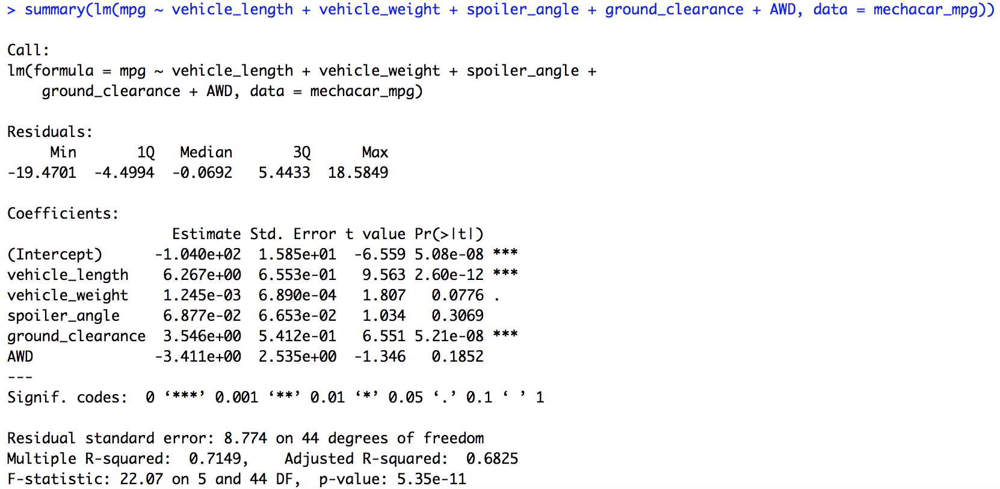
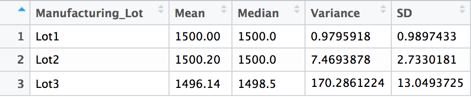
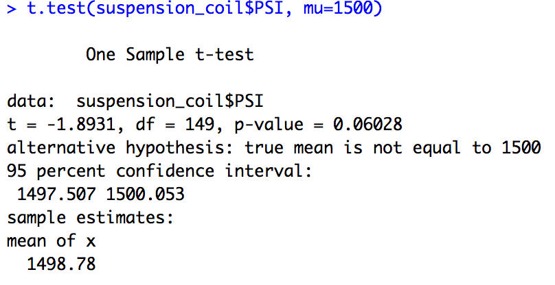
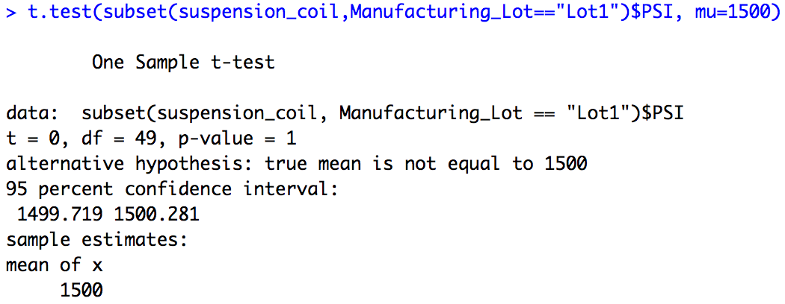
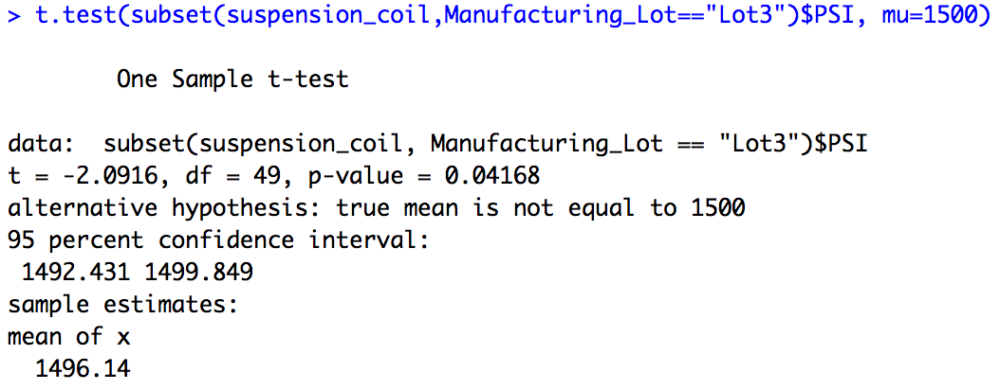

# MechaCar Statistical Analysis
## Project Overview 
I have been tasked with helping the data analytics team at AutosRUs' to review the production data for the company's lastest prototype, MechaCar. With this analysis, we can give insight that may aid manufacturing efforts as well as sales amongst competitors. For this project, we will complete the following: 

- Perform multiple linear regression analysis to identify which variables in the dataset predict the mpg of MechaCar prototypes
- Collect summary statistics on the pounds per square inch (PSI) of the suspension coils from the manufacturing lots
- Run t-tests to determine if the manufacturing lots are statistically different from the mean population
- Design a statistical study to compare vehicle performance of the MechaCar vehicles against vehicles from other manufacturers

## Linear Regression to Predict MPG
### Questions to Address: 
Which variables/coefficients provided a non-random amount of variance to the mpg values in the dataset? Is the slope of the linear model considered to be zero? Why or why not? Does this linear model predict mpg of MechaCar prototypes effectively? Why or why not?
### Results: 

The most significant varibles in this dataset are vehicle length and ground clearance, both providing a non-random amount of variance to the mpg values. After running a linear regression model on these factors against the vehicles mgp, we see that the two variables are statiscally significant given their respetive p-values, 2.60e-12 and 5.21e-08. Because the p-values are extremely small, they have a high level of significant. We can also conclude that there are factors outside of our dataset that have an effect on mpg due to the intercepts high level of significant. 

The slope of the linear model not considered to be zero. Assuming the confidence level is 95%, our p-value, 5.35e-11, is far less than our significance level of 0.05. We therefore have enough reason to reject the null hypothesis that our slope is zero. 

The linear model predicts mpg of MechaCar prototypes effiectly given the r-squared value is 0.7149, meaning that the linear regression model explains approx. 71% of the variability. 

## Summary Statistics on Suspension Coils
### Question to Address: 
The design specifications for the MechaCar suspension coils dictate that the variance of the suspension coils must not exceed 100 pounds per square inch. Does the current manufacturing data meet this design specification for all manufacturing lots in total and each lot individually? Why or why not?
### Results:

From the "total_summary" table, we see the total variance in PSI for all manufacturing lots is about 62, which meets the design specifications that the variance of the suspension coils must not exceed 100 lbs per sqaure inch. 

For the "lot_summary" table, we calculated the statistics for each lot seperately. According to this analysis, we can not conclude that current manufacturing meets the design specifications as Lot 3 had a variance of 170 lbs per sqaure inch, which well exceeds the desired variance. 
##  T-Tests on Suspension Coils
### Questions to Address:
Are the manufacturing lots as a whole statistically different from the population mean of 1,500 pounds per square inch? What about each lot individually?
### Results:

The results of the t-test to compare all manufacturing lots against the population mean of 1500 tell us that the samplee mean is 1498.78 and p-value is 0.06028. Based on this, we can conclude that they are not statistically different from the population mean. While the p-value is low, it is still greater than our signifance level of 0.05, meaning we fail to reject the null hypothesis.

For the t-test to compare Lot 1 to the population mean, we see the mean is 1500 and the p-value 1. This is identical to the population mean, meaning it is not statistically significant because there is no difference bewteen the two. 

As for Lot 2, the mean is 1500.2 and the p-value is 0.6072. The results are not statistically different from the population mean and the p-value > significance level, meaning we fail to reject the null hypothesis. 

The t-test for Lot 3 resulted in a mean of 1496.14 and a p-value of 0.04. Unlike Lot 1 and Lot 2, Lot 3 is statistically different from the population mean given the p-value is less than our significance level.

## Study Design: MechaCar vs Competition
There are countless factors that consumers take into consideration when it comes to purchaisng a new vechicle. In order to further assist AutosRUs' in performance against competiton, I would design another study that will analyze and compare metrics with that of the competition. This study will focus on the safety rating of the MechaCar prototype in comparrison to competitors safefty rating. 
  
### What metric or metrics are you going to test?
I would collect data for both the MechaCar prototype and comparable competitor models for the following metrics: safety rating, price, fuel efficiency, engine type, and maintaince costs on average.
### What is the null hypothesis or alternative hypothesis?
Null hypothesis: There is not a statistically significant relationship between price and the selected facors.  

Alternative hypothesis: There is indeed a statistically significant relationship between price and the selected facors.

### What statistical test would you use to test the hypothesis? And why?
I would perform a multiple linear regression model, which would consider the effect that all the metrics have on the price of the vehicle. Our dependent varibale is price, while all other metrics are independent variables. This model will give insight into which factors have the greatest impact on price and the ability for these factors to predict the optimal list price and the success of sales, in terms of the value compared to cost. 

 
